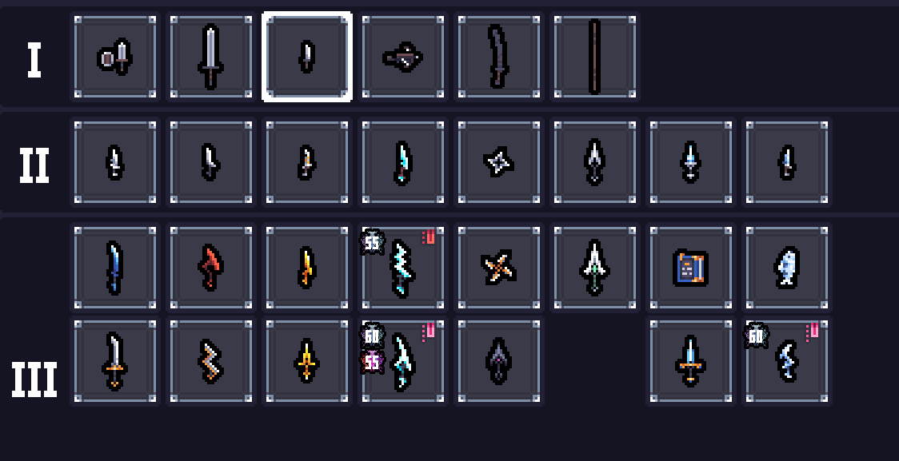
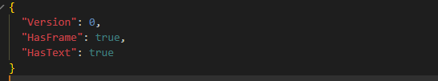

# Mira's Weapon Frame

## 📌 Overview

This mod adds a feature to TEAM HORAY's <a href="https://store.steampowered.com/app/2436940/_/">Sephiria</a> that displays the frame and the Hard Mode completion stats on weapons for which Hard Mode has been cleared.

The highest Hard Mode difficulty you have cleared is displayed at the top left of the icon.

If you clear the boss rush in RaidRaid, the Hard Mode values ​​will be displayed over the pink image on the left.



You can change the display settings for frames and numerical values ​​by modifying config.json.



"HasFrame" controls the frame display setting, while "HasText" controls the setting for displaying numerical values ​​in Hard Mode.

"true" is enabled; "false" is disabled.

You can change settings in-game by using <a href="https://github.com/Mira090/MiraModOptions">MiraModOptions</a>.

## 📥 Installation
1. Download the latest `MiraWeaponFrame-1.X.X.zip` from the Releases section and unzip it.
2. Create an `AddOns` folder inside the `Program Files (x86)\Steam\steamapps\common\Sephiria` folder.
3. Copy the `MiraWeaponFrame` folder into the `Program Files (x86)\Steam\steamapps\common\Sephiria\AddOns` folder.

Example:
```
Sephiria/
└── AddOns/
    └── MiraWeaponFrame/
        ├── Assets/
        ├── Libs/
        ├── config.json
        ├── metadata.json
        ├── MiraModBase.dll
        └── MiraWeaponFrame.dll
```

## 📝 Notes
- This repository and its contributors are in no way affiliated with Sephiria, TEAM HORAY, or any related organizations.